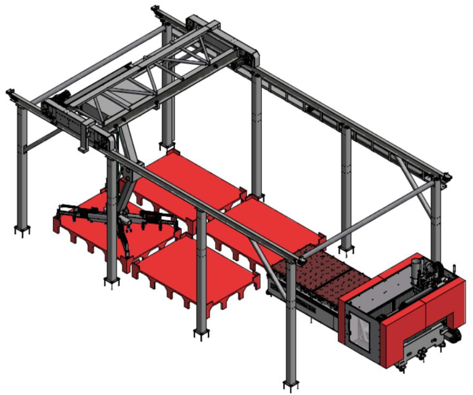
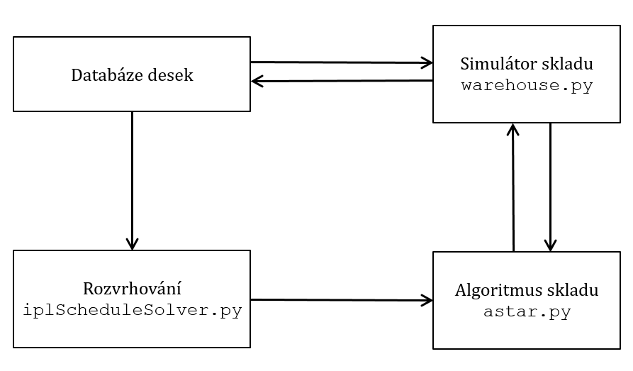

## Repořitář modulů vytvořených vrámci diplomové práce Optimální řízení toku materiálu v chaotickém skladu s výrobními stroji

# Architektura plánované aplikace s vytvořenými moduly

Komunikace mezi vytvořenými moduly je následující. Nejdříve musí být
vytvořena požadovaná fronta z dostupných desek z databáze skladu rozvrhovacím modulem
nebo případně ručně operátorem skladu. Fronta je dále zpracována A–Star
algoritmem, který potřebuje simulátor skladu. Proto musí být do simulátoru nahrán aktuální
stav skladu z databáze. Po získání posloupností akcí od A–Star jsou akce
provedeny reálným skladem a současně aplikovány na simulátor. Nakonec je
aktualizována databáze podle simulátoru a celý proces se může opakovat.

# Vytvořené moduly:

- warehouse.py Simulátor formální reprezentace skladu
- astar.py Algoritmus pro optimální pohyb materiálu ve skladu
- ilpScheduleSolver.py Program pro rozvrhování výroby na identických
- ilpScheduleTypeOfMachinesSolver.py a na dedikovaných strojích
- schedule-plus-astar.py Ukázka spojení astar.py s rozvrhováním výroby
- ilp-model.py ILP model pro rozvrhování s deadliny
- cp-model.py CP model pro rozvrhování s deadliny

# Ukázka běhu A-Star algoritmu skladu:

Searching path: [[1, 2, 6, 3], [8, 7, 5], [4, 9]] 
Input: (12, 14, 15) Output: [] Orders: (2, 3, 7, 8) Done: False -> for order (2, 3, 7, 8)
Found a path (length=10): 
[(1, -2), (1, -2), (0, 1), (-3, 1), (-3, 1), (-3, 1), (0, 1), (0, 2), (0, -2), (1, -2)]
How it goes: 
[[1, 2, 6, 3], [8, 7, 5], [4, 9]] 
Input: (12, 14, 15) Output: [] Orders: (2, 3, 7, 8) Done: False

                    |1|        
  |12|        |8|   |2|        
  |14|  |4|   |7|   |6|        
  |15|  |9|   |5|   |3|        
''####''^^^^''^^^^''^^^^''****''
[input]  #2    #1    #0  [output]
------------ Action: (1, -2) ----------

                    |1|        
  |12|              |2|        
  |14|  |4|   |7|   |6|        
  |15|  |9|   |5|   |3|   |8|
''####''^^^^''^^^^''^^^^''****''
[input]  #2    #1    #0  [output]
------------ Action: (1, -2) ----------

                    |1|        
  |12|              |2|        
  |14|  |4|         |6|   |7|
  |15|  |9|   |5|   |3|   |8|
''####''^^^^''^^^^''^^^^''****''
[input]  #2    #1    #0  [output]
------------ Action: (0, 1) ----------

  |12|              |2|        
  |14|  |4|   |1|   |6|   |7|
  |15|  |9|   |5|   |3|   |8|
''####''^^^^''^^^^''^^^^''****''
[input]  #2    #1    #0  [output]
------------ Action: (-3, 1) ----------

              |12|  |2|        
  |14|  |4|   |1|   |6|   |7|
  |15|  |9|   |5|   |3|   |8|
''####''^^^^''^^^^''^^^^''****''
[input]  #2    #1    #0  [output]
------------ Action: (-3, 1) ----------

              |14|             
              |12|  |2|        
        |4|   |1|   |6|   |7|
  |15|  |9|   |5|   |3|   |8|
''####''^^^^''^^^^''^^^^''****''
[input]  #2    #1    #0  [output]
------------ Action: (-3, 1) ----------

              |15|             
              |14|             
              |12|  |2|        
        |4|   |1|   |6|   |7|
        |9|   |5|   |3|   |8|
''####''^^^^''^^^^''^^^^''****''
[input]  #2    #1    #0  [output]
------------ Action: (0, 1) ----------

              |2|              
              |15|             
              |14|             
              |12|             
        |4|   |1|   |6|   |7|
        |9|   |5|   |3|   |8|
''####''^^^^''^^^^''^^^^''****''
[input]  #2    #1    #0  [output]
------------ Action: (0, 2) ----------

              |2|              
              |15|             
              |14|             
        |6|   |12|             
        |4|   |1|         |7|
        |9|   |5|   |3|   |8|
''####''^^^^''^^^^''^^^^''****''
[input]  #2    #1    #0  [output]
------------ Action: (0, -2) ----------

              |2|              
              |15|             
              |14|             
        |6|   |12|        |3|
        |4|   |1|         |7|
        |9|   |5|         |8|
''####''^^^^''^^^^''^^^^''****''
[input]  #2    #1    #0  [output]
------------ Action: (1, -2) ----------

              |15|             
              |14|        |2|
        |6|   |12|        |3|
        |4|   |1|         |7|
        |9|   |5|         |8|
''####''^^^^''^^^^''^^^^''****''
[input]  #2    #1    #0  [output]
[[], [15, 14, 12, 1, 5], [6, 4, 9]] 
Input: [] Output: [2 3 7 8] Orders: (2, 3, 7, 8) Done: True
Total expanded nodes: 10 Time: 0.01
