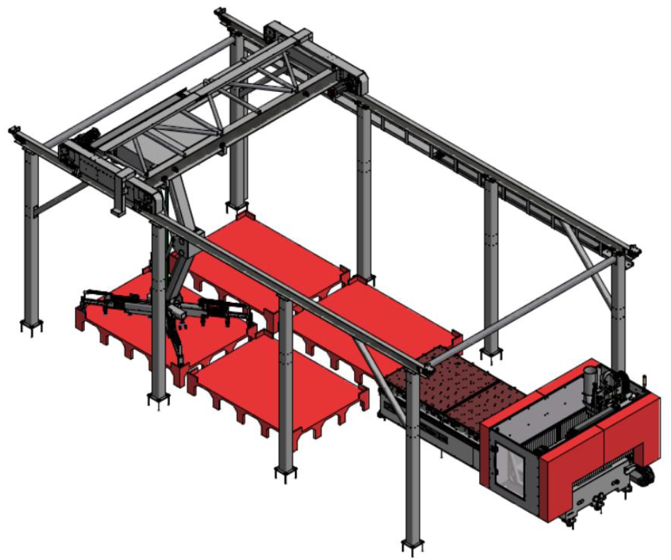
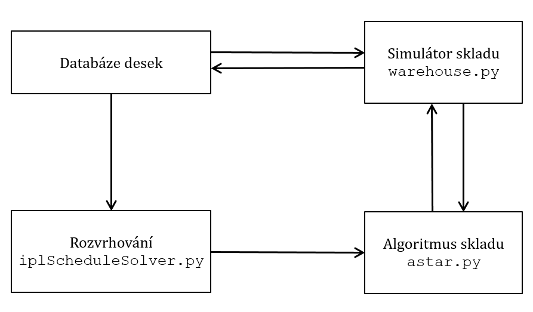

# PREREQUISITIES
* MATLAB - Optimalization Toolbox, Parallel Toolbox ... etc.
* Fanuc - Focus (32 bits /or if lucky 64bits/) + CNC Guide 2 
* Python 3.10 (32 bits /or if lucky 64bits/)
* Python Packages: Numpy
* ! It's needed to have Python 32-bit /or if lucky 64bits/ in PATH !
* (Docker :P) 

## Repository of Modules Created for the Thesis



# Architecture of the Planned Application with Created Modules

The communication between the created modules is as follows. First, a required queue of available boards from the warehouse database must be created by the scheduling module or manually by the warehouse operator. The queue is then processed by the A-Star algorithm, which requires the warehouse simulator. Therefore, the current state of the warehouse must be loaded into the simulator from the database. After obtaining the sequence of actions from A-Star, the actions are performed in the real warehouse and simultaneously applied to the simulator. Finally, the database is updated according to the simulator, and the whole process can repeat.



# Created Modules:

- **warehouse.py**: A simulator for formal representation of the warehouse
- **astar.py**: An algorithm for optimal material movement in the warehouse
- **ilpScheduleSolver.py**: A program for production scheduling on identical machines
- **ilpScheduleTypeOfMachinesSolver.py**: A program for scheduling on dedicated machines
- **schedule-plus-astar.py**: A demonstration of combining astar.py with production scheduling
- **ilp-model.py**: An ILP model for scheduling with deadlines
- **cp-model.py**: A CP model for scheduling with deadlines

# A-Star Algorithm Warehouse Run Example:

```
Searching path: [[1, 2, 6, 3], [8, 7, 5], [4, 9]] 
Input: (12, 14, 15) Output: [] Orders: (2, 3, 7, 8) Done: False -> for order (2, 3, 7, 8)
Found a path (length=10): 
[(1, -2), (1, -2), (0, 1), (-3, 1), (-3, 1), (-3, 1), (0, 1), (0, 2), (0, -2), (1, -2)]
How it goes: 
[[1, 2, 6, 3], [8, 7, 5], [4, 9]] 
Input: (12, 14, 15) Output: [] Orders: (2, 3, 7, 8) Done: False

                    |1|        
  |12|        |8|   |2|        
  |14|  |4|   |7|   |6|        
  |15|  |9|   |5|   |3|        
''####''^^^^''^^^^''^^^^''****''
[input]  #2    #1    #0  [output]
------------ Action: (1, -2) ----------

                    |1|        
  |12|              |2|        
  |14|  |4|   |7|   |6|        
  |15|  |9|   |5|   |3|   |8|
''####''^^^^''^^^^''^^^^''****''
[input]  #2    #1    #0  [output]
------------ Action: (1, -2) ----------

                    |1|        
  |12|              |2|        
  |14|  |4|         |6|   |7|
  |15|  |9|   |5|   |3|   |8|
''####''^^^^''^^^^''^^^^''****''
[input]  #2    #1    #0  [output]
------------ Action: (0, 1) ----------

  |12|              |2|        
  |14|  |4|   |1|   |6|   |7|
  |15|  |9|   |5|   |3|   |8|
''####''^^^^''^^^^''^^^^''****''
[input]  #2    #1    #0  [output]
------------ Action: (-3, 1) ----------

              |12|  |2|        
  |14|  |4|   |1|   |6|   |7|
  |15|  |9|   |5|   |3|   |8|
''####''^^^^''^^^^''^^^^''****''
[input]  #2    #1    #0  [output]
------------ Action: (-3, 1) ----------

              |14|             
              |12|  |2|        
        |4|   |1|   |6|   |7|
  |15|  |9|   |5|   |3|   |8|
''####''^^^^''^^^^''^^^^''****''
[input]  #2    #1    #0  [output]
------------ Action: (-3, 1) ----------

              |15|             
              |14|             
              |12|  |2|        
        |4|   |1|   |6|   |7|
        |9|   |5|   |3|   |8|
''####''^^^^''^^^^''^^^^''****''
[input]  #2    #1    #0  [output]
------------ Action: (0, 1) ----------

              |2|              
              |15|             
              |14|             
              |12|             
        |4|   |1|   |6|   |7|
        |9|   |5|   |3|   |8|
''####''^^^^''^^^^''^^^^''****''
[input]  #2    #1    #0  [output]
------------ Action: (0, 2) ----------

              |2|              
              |15|             
              |14|             
        |6|   |12|             
        |4|   |1|         |7|
        |9|   |5|   |3|   |8|
''####''^^^^''^^^^''^^^^''****''
[input]  #2    #1    #0  [output]
------------ Action: (0, -2) ----------

              |2|              
              |15|             
              |14|             
        |6|   |12|        |3|
        |4|   |1|         |7|
        |9|   |5|         |8|
''####''^^^^''^^^^''^^^^''****''
[input]  #2    #1    #0  [output]
------------ Action: (1, -2) ----------

              |15|             
              |14|        |2|
        |6|   |12|        |3|
        |4|   |1|         |7|
        |9|   |5|         |8|
''####''^^^^''^^^^''^^^^''****''
[input]  #2    #1    #0  [output]
[[], [15, 14, 12, 1, 5], [6, 4, 9]] 
Input: [] Output: [2 3 7 8] Orders: (2, 3, 7, 8) Done: True
Total expanded nodes: 10 Time: 0.01

```

## TODO

# MATLAB - Main

- ZBYTKY !!!!!

- ERROR pri prenosu desky, objevuje se pri PLACE preraci, NEJSPI SPATNE ULOZENO var "pozice_time" 
```
FANUC: Move done.
Brace indexing is not supported for variables of this type.

Error in spousteci (line 240)
                pozice_time{konec}=[pozice_time{konec};matice_desek(ID_deska_poc,9)];

Error in ManualniPreskladneni/preskladnenidesek (line 224)
    spousteci(param);

Error in ManualniPreskladneni>@(~,~)preskladnenidesek() (line 93)
buttonManPreskladneni.ButtonPushedFcn = @(~,~) preskladnenidesek();
 
Error using appdesservices.internal.interfaces.model.AbstractModel/executeUserCallback (line 282)
Error while evaluating Button PrivateButtonPushedFcn."
```
- ERROR generovani a mazani skladu
``` 
Brace indexing is not supported for variables of this type.

Error in GenerovaniDesek (line 197)
            pozice_time{pozicedesek(i)}=[pozice_time{pozicedesek(i)}; (matice_desek(find(matice_desek(:,1))==cisla_zamichej(i),9))];

Error in GenerovaniSkladu/nahodneSklad (line 38)
        GenerovaniDesek()

Error in GenerovaniSkladu>@(~,~)nahodneSklad() (line 19)
    nahodneSkladButton.ButtonPushedFcn = @(~,~) nahodneSklad();
 
Error using appdesservices.internal.interfaces.model.AbstractModel/executeUserCallback (line 282)
Error while evaluating Button PrivateButtonPushedFcn.
"Error using vymazanidesek (line 42)
Invalid Simulink object name: 'RobotickyManipulator_Simscape/R13'.

Error in HlavniOkno>HlavniMenu/VymazatSklad (line 238)
        vymazanidesek();

Error in HlavniOkno>@(~,~)VymazatSklad() (line 72)
    vymazatSkladButton.ButtonPushedFcn = @(~,~) VymazatSklad(); - Show complete stack trace
Caused by:
    Error using vymazanidesek (line 42)
    Unable to find block 'R13'. - Show complete stack trace 
Error using appdesservices.internal.interfaces.model.AbstractModel/executeUserCallback (line 282)
Error while evaluating Button PrivateButtonPushedFcn.
```
- UI Aktualni stav -- NOT WORKING
- UI Naskladneni -- NOT WORKING


